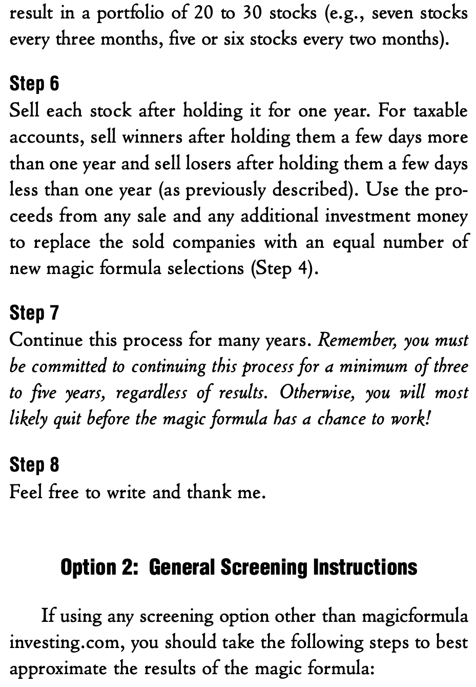
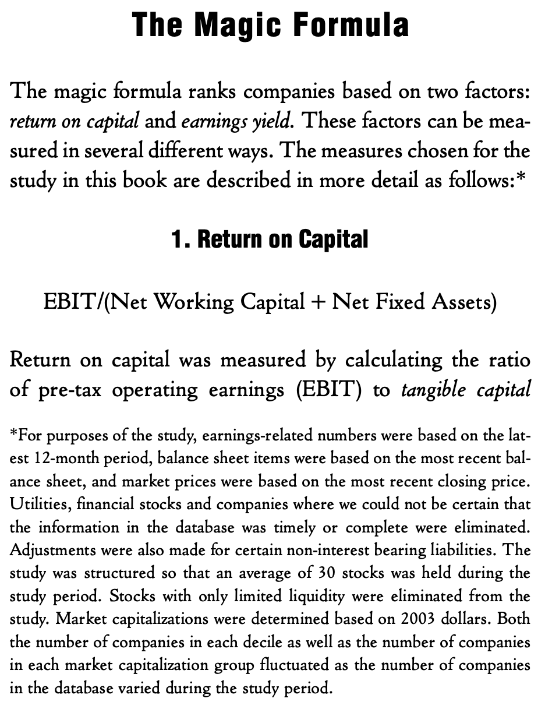
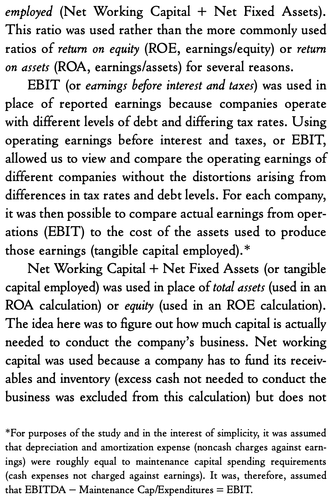
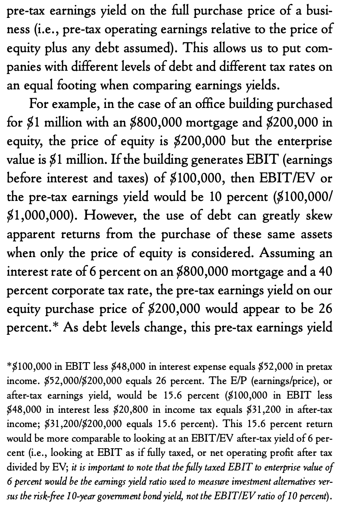
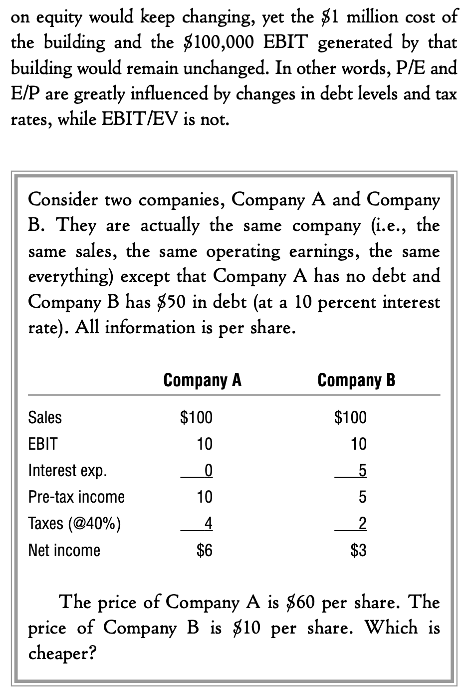
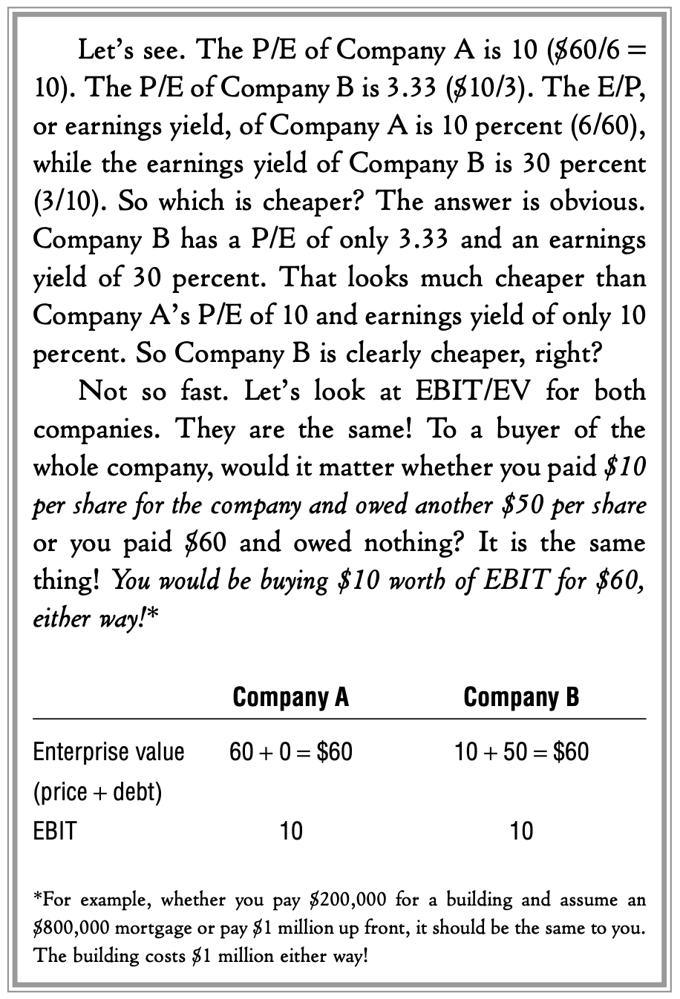

This code repo is an implementation of [The Little Book That Still Beats the Market](https://www.amazon.com/gp/product/0470624159).

**Disclaimer:** The codes and data are for research purposes only.

## Quick notes

- The author of the book, [Joel Greenblatt](https://en.wikipedia.org/wiki/Joel_Greenblatt), does not provide source codes or actual sources of the data he is using for the [Magic Formula Investing](https://www.magicformulainvesting.com/) website. 

- My implementation is based on free data of [NASDAQ screener](https://www.nasdaq.com/market-activity/stocks/screener) with [NASDAQ API](https://api.nasdaq.com/api/screener/stocks) and [Yahoo Finance](https://finance.yahoo.com/). So my final result could be a bit different from Greenblatt's.

## How to use

Before we start, the first version of the Little Book can be downloaded [here](https://docs.google.com/viewer?a=v&pid=sites&srcid=ZGVmYXVsdGRvbWFpbnxla3JvbmVkZXNpZ258Z3g6MmI0OTZjZTI1OTNhZTMwNw) which the below screenshots were captured from.

The result from this code repo can be used instead of the [Magic Formula Investing](https://www.magicformulainvesting.com/) website. **Again, for research purposes only**.

The Option 1 is sufficient for us to use for long-term investment. However, it is also interesting to check the Option 2.

## The Magic Formula

## My 1-page summary of the Magic Formula

## References

1. Yahoo! Finance market data downloader (+faster Pandas Datareader): https://github.com/ranaroussi/yfinance

1. Get all publicly traded tickers with this library: https://github.com/shilewenuw/get_all_tickers